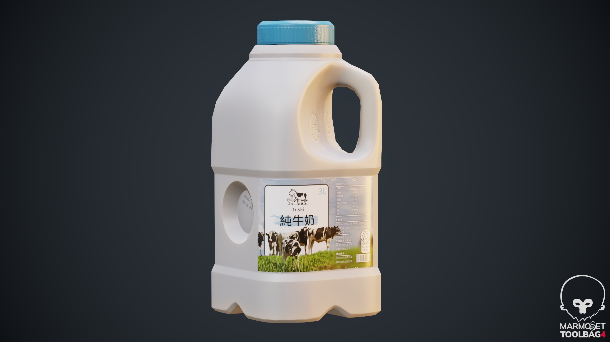

# PBR.MilkBottle

# 提交#2
# 提交#3
# 提交#4

## 🚩目录

- [✨概述](#✨概述)
- [🛠️使用软件](#🛠️使用软件)
- [💾导出格式](#💾导出格式)
- [📜模型信息](#📜模型信息)
- [🖌️贴图与材质](#🖌️贴图与材质)
- [🚀更新日志](#🚀更新日志)
- [🎉引用与鸣谢](#🎉引用与鸣谢)

## ✨概述

一个为**瓶内液体着色器教程**而制作的**牛奶塑料瓶**模型，针对实时渲染进行优化，包含完整的PBR材质。

## 🛠️ 使用软件

- **建模**: Blender 3.3.2
- **材质**: Substance 3D Painter 9.1.1，Adobe Photoshop 2019
- **渲染**: Marmoset Toolbag 4

## 💾导出格式

- **模型文件**: `.fbx`

- **贴图文件**: `.png`, `.tga`，`.jpg`

## 📜模型信息

- **三角面数**: 1.3k

- **顶点数**: 657

- **扫描模型**: 否

- **UV展开**: 是

- **第二套光照UV**: 否

- **材质**: 是

- **蒙皮**: 否

- **绑定**: 否

## 🖌️贴图与材质

- **PBR**: 是
- **材质格式**: Metalness/Roughness
- **材质数**: 1
- **贴图数**: 8
- **贴图分辨率**: 1024 x 1024
- **法线贴图**: 是

| 贴图                   | 文件名               | 格式 | 描述                     |
| ---------------------- | -------------------- | ---- | ------------------------ |
| Base Color             | T_MilkBottle_D.tga   | TGA  | 基本颜色                 |
| Normal                 | T_MilkBottle_N.tga   | TGA  | 法线贴图                 |
| ORM                    | T_MilkBottle_ORM.tga | TGA  | 环境遮蔽、粗糙度和金属值 |
| Base Color             | T_MilkBottle_D.jpg   | JPG  | 基本颜色JPG              |
| Metalness              | T_MilkBottle_M.jpg   | JPG  | 金属值                   |
| Ambient Occlusion (AO) | T_MilkBottle_AO.jpg  | JPG  | 环境遮蔽                 |
| Normal                 | T_MilkBottle_N.png   | PNG  | 法线贴图PNG              |
| Roughness              | T_MilkBottle_R.jpg   | JPG  | 粗糙度                   |

## 🚀更新日志
 ### v1.0 - 2024-07-18

 #### 初始发布

 - **模型文件**: 发布初始模型文件，格式为 `.fbx` 。
 - **PBR材质**: 完整的PBR材质设置，包括基色、法线、粗糙度和金属度贴图。

## 🎉引用与鸣谢

- **牛奶塑料桶顶部扫描模型** 
  - **资产**：[Milkbottle Section](https://sketchfab.com/3d-models/milkbottle-section-f9755073373f48119ead356a7eb6961b)
  - **作者**：[Patrick Thorn](https://sketchfab.com/patrickthorn)
  - **来源**：https://sketchfab.com/3d-models/milkbottle-section-f9755073373f48119ead356a7eb6961b
  - **许可证**: CC BY 4.0

  

- **兔斯基**

  - **资产**：兔斯基
  - **作者**：王卯卯（MOMO）

  

- **Resource Han Rounded字体**

  - **资产**：[Resource Han Rounded](https://github.com/CyanoHao/Resource-Han-Rounded)
  - **作者**：[CyanoHao](https://github.com/CyanoHao)
  - **来源**：https://github.com/CyanoHao/Resource-Han-Rounded
  - **许可证**: [MIT,Public Domain,SIL OFL](https://github.com/CyanoHao/Resource-Han-Rounded?tab=License-1-ov-file)

  

- **奶牛照片**

  - **资产**：[Cows on Farm Against Sky](https://www.pexels.com/photo/cows-on-farm-against-sky-325257/)
  - **作者**：[Matthias Zomer](https://www.pexels.com/@matthiaszomer/)
  - **来源**：https://www.pexels.com/photo/cows-on-farm-against-sky-325257/
  - **许可证**: [Pexels](https://www.pexels.com/license/)
